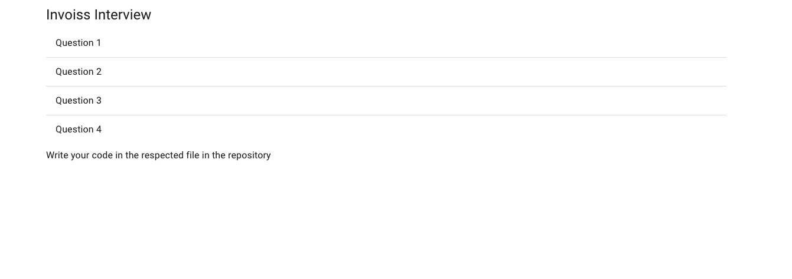

[<p align="center"></p>](https://invoiss.com)

<div align="center">
<h1>Welcome to Invoiss Technical Interview</h1> 
</div>

## Getting Started

First, fork this repository,open up the project and run the development server:

```bash
yarn
yarn dev
```

Open [http://localhost:3000](http://localhost:3000) with your browser to see the result.

**Once you see the home page below, you are on your way! Just create a pull request once you are done!**
<p align="center"></p>
